# GitOps

The steps below are based in the official [documentation](https://learn.microsoft.com/en-us/azure/azure-arc/kubernetes/tutorial-use-gitops-flux2?tabs=azure-cli).

## Step 1. Git repo setup

For this lab you need to have a Git repository to which your K8s cluster GitOps engine will be synchronized with. You can fork this [repo as an example](https://github.com/ruifelixpereira/arc-cicd-demo-gitops).

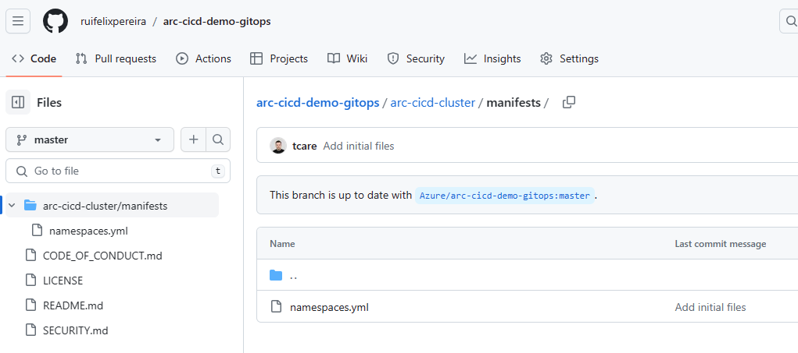

As an example I've forked this repo to a new private repo named `https://github.com/ruifelixpereira/cicd-gitops`.

If you are using a GitHub private repo, you need to generate a PAT token with full access to the repo.

## Step 2. Customize your settings

Copy the sample file `gitops/sample.env` to `gitops/.env` and customize the settings to your environment. All the script files will use these settings.

```bash
# Azure settings
RESOURCE_GROUP="your resource group name"
CLUSTER_NAME="your arc-enabled k8s cluster name"

# Git repository settings
GIT_REPO="your git repo URL"
GIT_USER="your git repo user"
GIT_TOKEN="your git access token"
```

## Step 3. Login with az cli

Login with `az login` and set your desired subscription. You can check if you are using the correct subscription by running `az account show` and checking the `id` and `name` fields.

## Step 4. Connect GitOps repo

Run the script `connect-gitops-repo.sh` to connect the git repo to the cluster.

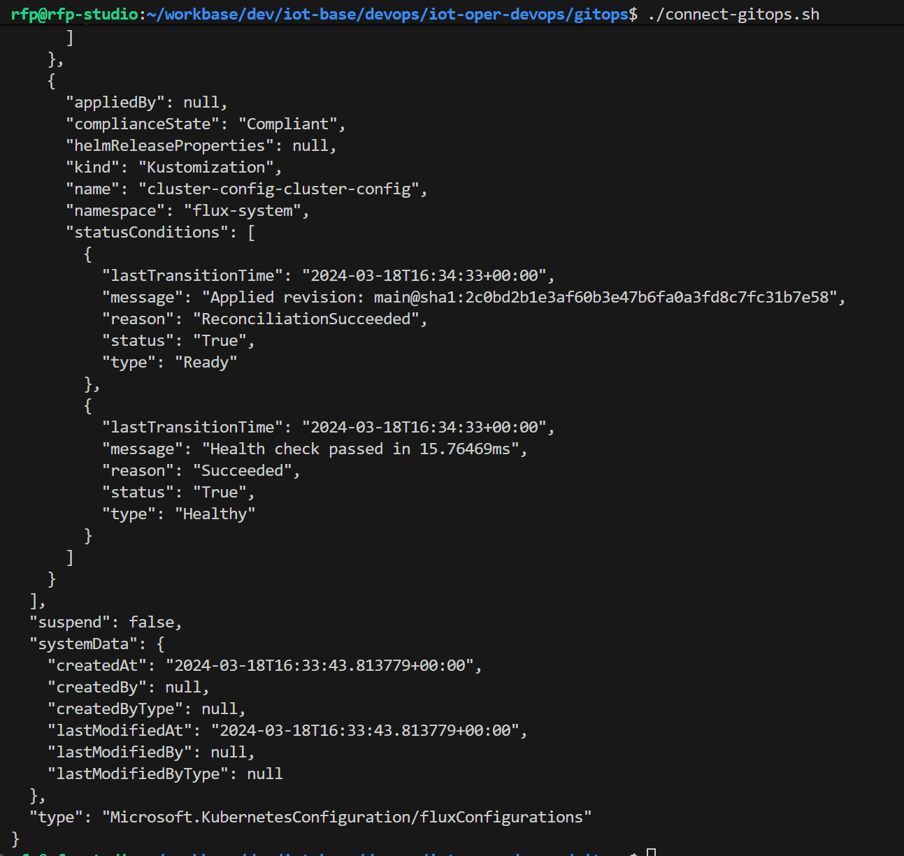

When this is done for the first time, it install the GitOps engine (Flux) in the K8s cluster and creates a new namespace `flux-system` where the engine will be running. You can check the new installed extension in the Azure Portal (navigate to your arc-enabled K8s resource and select the Extensions option).

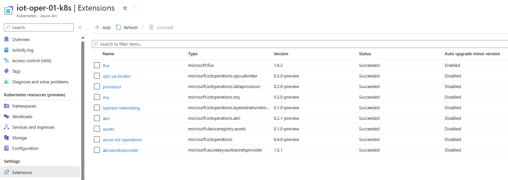

Additionally, if there are yaml files in the source git repo, they are also synchronized. In our example we only have a simple `namespaces.yaml` that will trigger the creation of these 2 new namespaces in the target K8s cluster:

```yaml
kind: Namespace
apiVersion: v1
metadata:
  name: dev
---
kind: Namespace
apiVersion: v1
metadata:
  name: stage
```

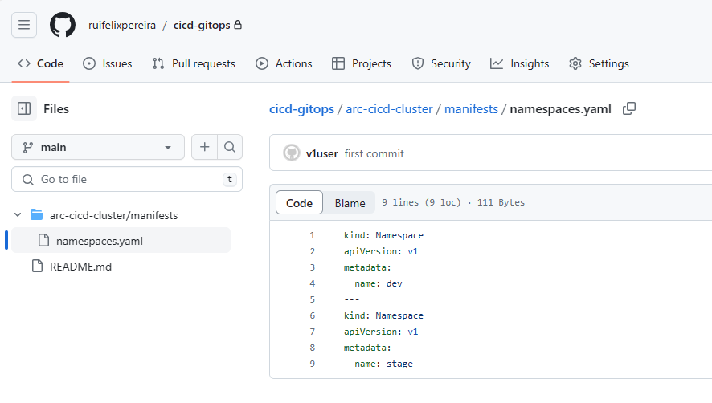

You can check in the Azure Portal that GitOps was configured (navigate to your arc-enabled K8s resource and select the GitOps option) and the status and the date of the last synchronization (the first takes more time to install the Flux GitOps engine):

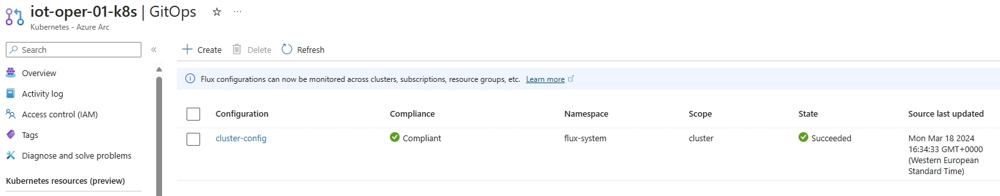

And the details of the configuration:

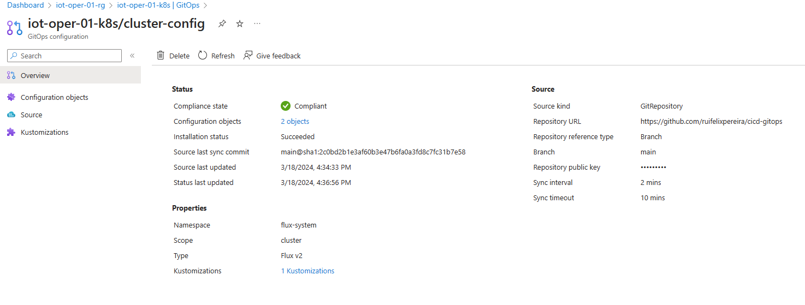

Check on the local K8s cluster:

```bash
# list Kubernetes namespaces; there should be a flux-system namespace and the two new dev and stage namespaces
kubectl get ns
 
# get pods in the flux-system namespace
kubectl get pods -n flux-system

# check the configuration that was created in the cluster-config namespace
# this is a resource of type FluxConfig
# in the spec, you will find a gitRepository and two kustomizations
kubectl get fluxconfigs cluster-config -o yaml -n flux-system

# check the git repository; this is a resource of kind GitRepository
# the Flux source controller uses the information in this
# resource to download the git repo locally
kubectl get gitrepo cluster-config -o yaml -n flux-system

# check the kustomizations
kubectl get kustomizations cluster-config-cluster-config -o yaml -n flux-system
```

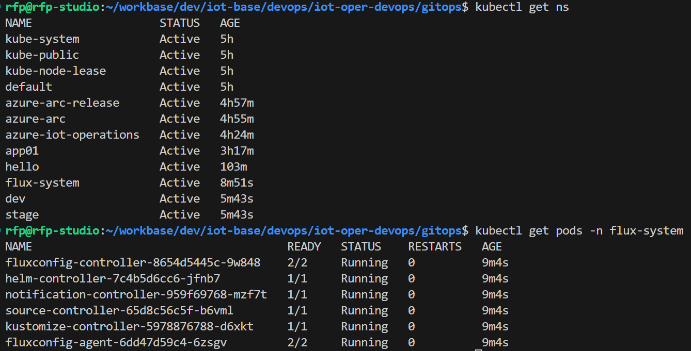


## Step 5. Change something in the repo to validate synchronization

Now that we have our arc-enabled K8s cluster configured with GitOps to synchronize with our Git repo, let's add something new to validate that the synchronization is working.

In your Git repo commit and push the changes to add the sample file `sample-apps/nginx-deployment.yaml` that will create a new deployment in the `dev` namespace, running a simple Nginx.

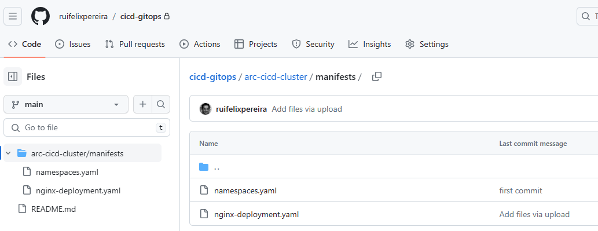

Wait for the synchronization to happen (it should take a couple of minutes).

Check in the Azure Portal the last sync:

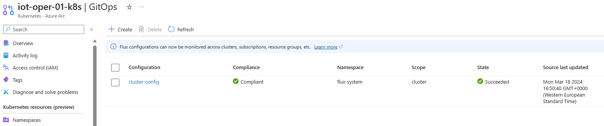

Check locally in your K8s cluster that the new deployment was created:

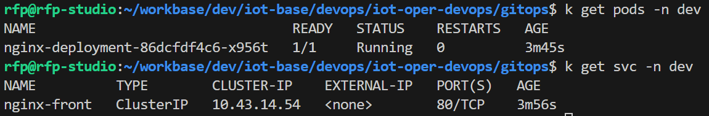


## Step 6. Test the new deployment

If you used the provided sample `nginx-deployment` application and defined your namespace as `dev`, check the service being exposed and forward to a local port:
    
```bash
kubectl get svc -n dev

kubectl port-forward services/nginx-front 28016:80 -n dev

curl http://localhost:28016
```

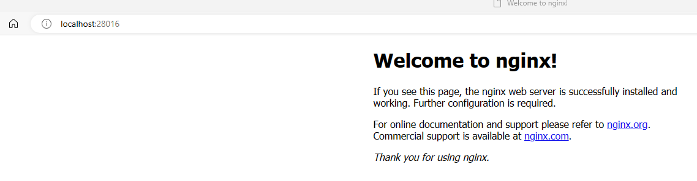
