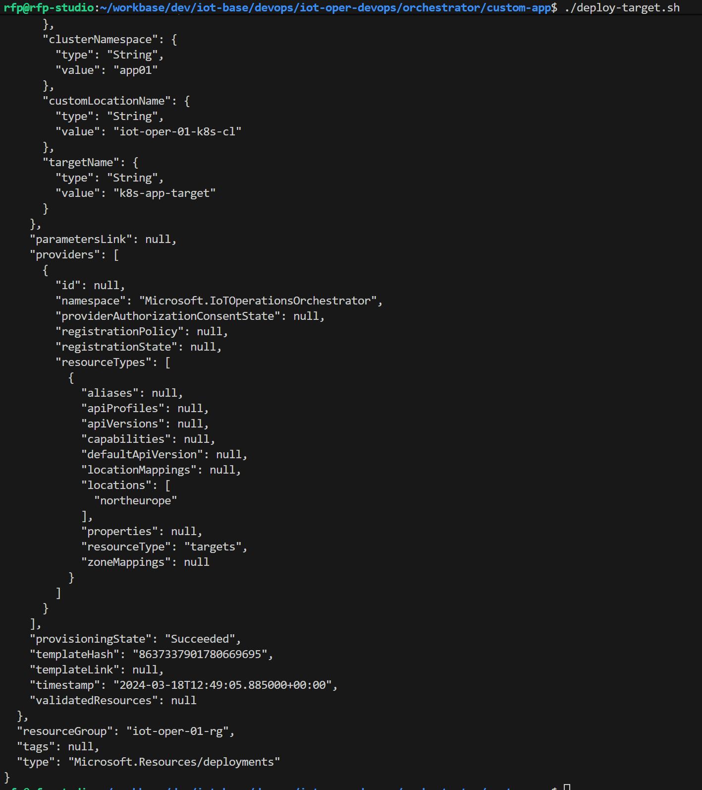
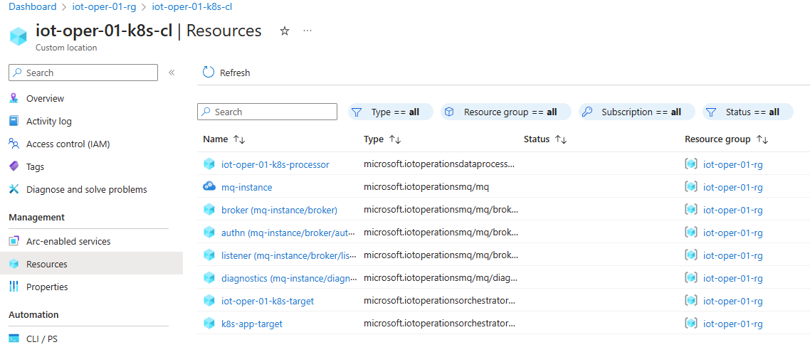
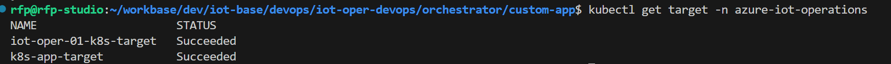
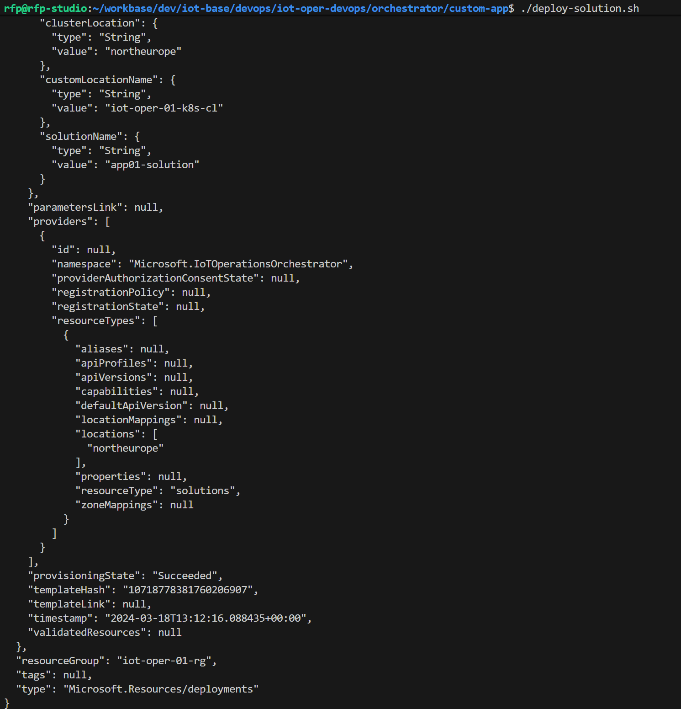
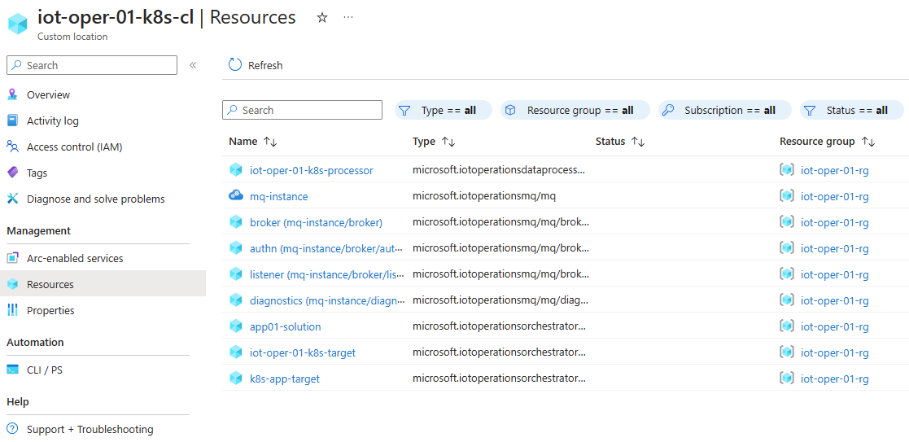
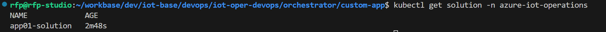
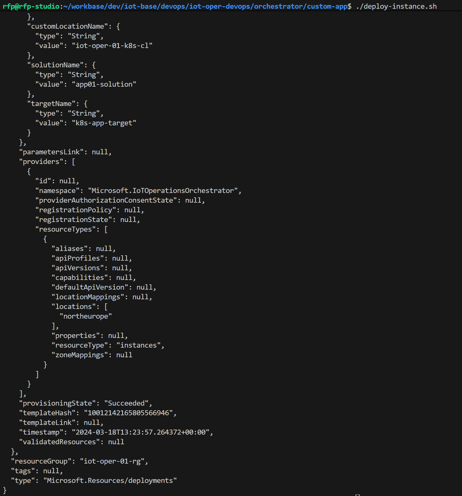
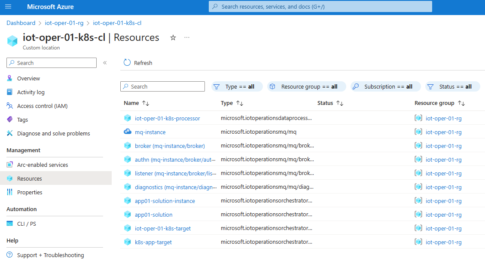

# IoT Orchestrator scenario to deploy your K8s application

In this scenario you want to accomplish the following:
- Deploy your application to your edge K8s.
- Your application is defined in a K8s Deployment yaml manifest, that resides in your git repo. You can use the sample application `sample-apps/azure-vote.yaml` for testing.


## Concepts

There are some concepts that need to be understood before you can proceed with this scenario:
- **Custom location**: A custom location is a resource that represents an Azure Arc-enabled Kubernetes cluster. It allows you to deploy resources to the Custom location (like an Azure region), which is to say, to the edge K8s cluster represented by that Custom location.
- **Namespace**: In Kubernetes, namespaces provide a mechanism for isolating groups of resources within a single cluster. Names of resources need to be unique within a namespace, but not across namespaces. You can use namespaces to organize your custom applications inside the edge K8s clusters.


## Step 1. Login with az cli

Login with `az login` and set your desired subscription. You can check if you are using the correct subscription by running `az account show` and checking the `id` and `name` fields.

## Step 2. Customize your settings

Copy the sample file `orchestrator/custom-app/sample.env` to `orchestrator/custom-app/.env` and customize the settings to your environment. All the script files will use these settings.

```bash
RESOURCE_GROUP="your resource group name"
CLUSTER_LOCATION="your region"
CUSTOM_LOCATION_NAME="the name of your custom location"

# Target name
TARGET_NAME="your target name"

# Target K8s namespace where custom app will be deployed in your edge cluster
NAMESPACE="your namespace (existing or to be created)"

# Solution name
SOLUTION_NAME="your solution name"
```

## Step 3. Define and deploy your Target manifest

- Use the example provided in folder `orchestrator/custom-app`.
- You can check the `target.bicep` to understand the template being deployed.
- Run the file `deploy-target.sh`.

    

After following these steps you can validate what was deployed, which for now is just the Target definition. If you used the provided example, the Target name is `k8s-app-target`:
- In the Azure Portal, navigate to your Custom Location and under the Resources option you can see what is deployed and you can find the new Target definition `k8s-app-target`.

    

- In your local edge K8s you can also check the new Target resource that was synchronized.

    


## Step 4. Define and deploy your Solution description manifest

- You can check the `solution.bicep` to understand the template being deployed.
- Run the file `deploy-solution.sh`.

    

After following these steps you can validate what was deployed, which for now is just the Solution definition/metadata and not the custom app solution itself. If you used the provided example, the Solution name is `app01-solution`:
- In the Azure Portal, navigate to your Custom Location and under the Resources option you can see what is deployed and you can find the new Solution definition `app01-solution`.

    

- In your local edge K8s you can also check the new Solution resource that was synchronized.

    


## Step 5. Define and deploy your Instance manifest

- You can check the `instance.bicep` to understand the template being deployed.
- Run the file `deploy-instance.sh`.

    

After following these steps you can validate what was deployed, which for now is the Instance definition/metadata that also triggers the deployment of the custom app in the target K8s cluster. If you used the provided example, the Instance name is `app01-solution-instance`:
- In the Azure Portal, navigate to your Custom Location and under the Resources option you can see what is deployed and you can find the new Instance definition `app01-solution-instance`.

    

- In your local edge K8s you can also check the new custom app deployed in the defined namespace. If you used the provided sample `azure-vote` application and defined your namespace as `app01` you should see this precise namespace, the corresponding pods and services.


## Step 6. Test the custom app

If you used the provided sample `azure-vote` application and defined your namespace as `app01`, check the service being exposed and forward to a local port:

```bash
kubectl get svc -n app01

kubectl port-forward services/azure-vote-front 28016:80 -n app01

curl http://localhost:28016
```


