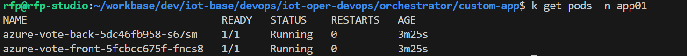
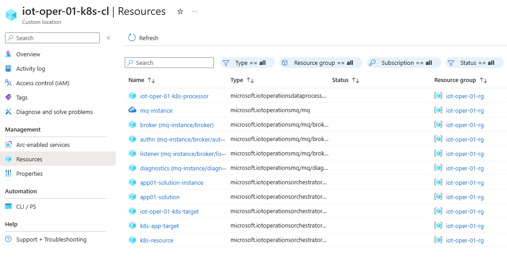
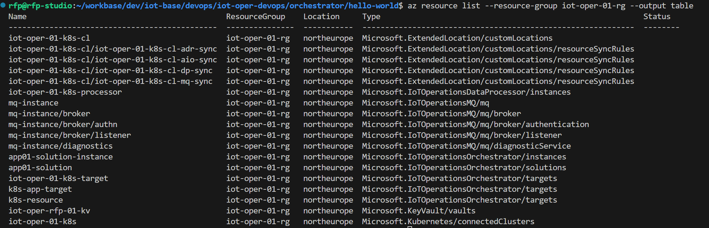
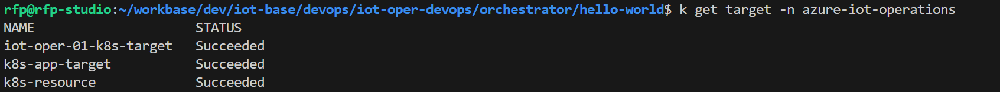
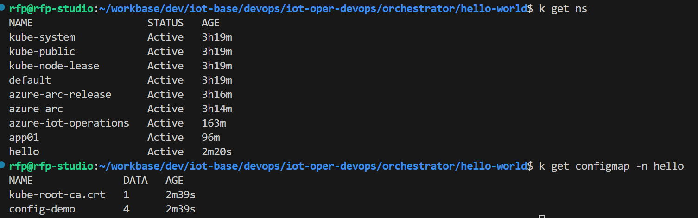
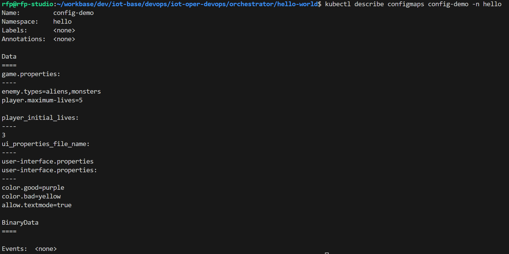

# Orchestrator - Hello world with config map

In this scenario you want to deploy a simple config map to your edge K8s. All the materials are located in the folder `orchestrator/hello-world`.

## Step 1. Login with az cli

Login with `az login` and set your desired subscription. You can check if you are using the correct subscription by running `az account show` and checking the `id` and `name` fields.

## Step 2. Customize your settings

Edit the file `deploy-hello.sh` and customize the settings to your environment.

```bash
RESOURCE_GROUP="your resource group name"
CLUSTER_LOCATION="your region"
CUSTOM_LOCATION_NAME="the name of your custom location"
```

## Step 3. Define and deploy your Target manifest

- Use the example provided in folder `orchestrator/hello-world`.
- You can check the `main.bicep` to understand the template being deployed. In this case it's using the `config-map.yaml` file as an example, that is loaded locally. This example instead of defining the typical 3 manifests (Solution, Target and Instance), we just define a Target manifest with components of a solution. It's a simpler approach but kind of less flexible.
- Run the file `deploy-hello.sh`.

    

After following these steps you can validate what was deployed. If you used the provided example, the Target name is `k8s-resource`:
- In the Azure Portal, navigate to your Custom Location and under the Resources option you can see what is deployed and you can find the new Target definition `k8s-resource`.

    

- You can also check the resources with this command:

    ```bash
    az resource list --resource-group $RESOURCE_GROUP --output table
    ```

    

- In your local edge K8s you can also check the new Target resource `k8s-resource` that was synchronized.

    

- As well as the new namespace `hello` and the new config map `config-demo` in your local edge K8s.

    

- Finally, you can check the contents of the new config map `config-demo`:

    ```bash
    kubectl describe configmaps config-demo -n hello
    ```

    

